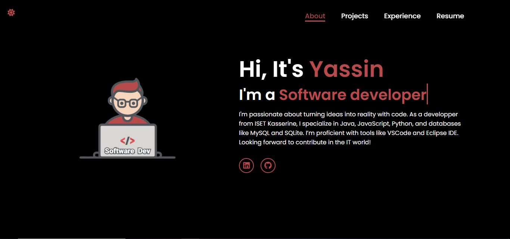

# Portfolio Website

📝 **Project Overview**: This is a portfolio website showcasing my work, built with a clean and modern design using HTML, CSS, and JavaScript. It features a responsive layout and interactive elements to provide a user-friendly experience.

If you find this repository useful, feel free to fork it and give it a star ⭐.

<div align="center">
  
  
  
  
  <a>
    
  </a>
</div>

## Table of Contents
- [🚀 Demo](#demo)
- [🖼️ Screenshots](#screenshots)
- [💻 Technologies](#technologies)
- [⚙️ Installation](#installation)
- [📜 License](#license)

## Demo

[View the live demo](https://shadowxdgamer.netlify.app/)

## Screenshots


*The homepage showcasing a quick about me.*


*The Projects section highlighting individual work with hover effects.*

## Features

✨ **Key Features**:
- Modern, responsive design optimized for various devices
- Project cards with hover effects leading to GitHub repositories
- Dark/light theme toggle
- Interactive and user-friendly layout

## Technologies

🛠️ **Built With**:
- **HTML5**
- **CSS3**
- **JavaScript**

## Installation

1. **📥 Clone the repository**:
   ```bash
   git clone https://github.com/shadowxdgamer/Portfolio.git
   cd Portfolio

## 📄 License

This project is licensed under the MIT License. 

